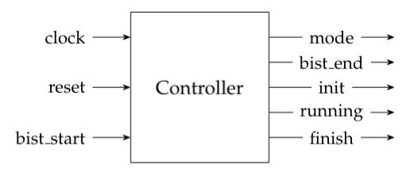
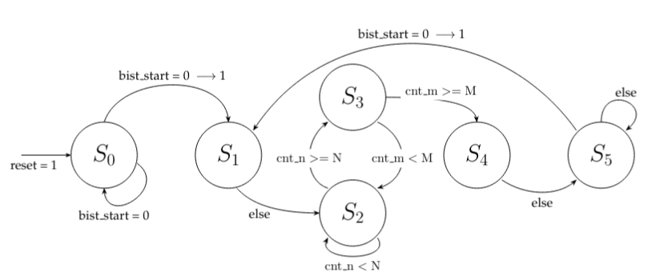
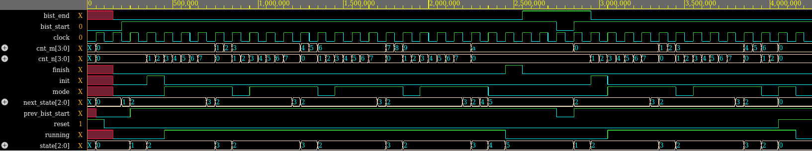

   

# Verilog Simple State Machine

## File Structure

In the Verilog folder, the Verilog code of the testbench and the design is located. Images for documentation purposes are in the Images folder. A PDF describing the state machine in detail is in the Documentation folder.

## Description
A simple state machine is implemented. It is represented by the controller in the figure below.

The state machine module contains three registers. The first register \textit{cnt\_n} is responsible for keeping track of how many clock periods have passed. In the state $S_2$, it is repeatedly compared with the user-defined number of clock cycles, N. The second register \textit{cnt\_m} indicates how often the sequence occurred in the output. It enables a repetition of the sequence until the user-defined variable M is reached. The last register \textit{prev\_bist\_start} stores the \textit{bist\_start} value of the previous clock cycle, to enable a detection of a logic level transition. 

By setting the input \textit{reset} to 1, the state $S_0$ will always be reached at the next rising edge of the clock. It has priority over all other input variables. Every input signal is read at the rising edge of the clock signal, i.e. they are synchronous. 

The outputs in each state behave according to the table below. 

|State |  mode |  init |  running |  finish|   bist_end|
|  -------| ------| ------| ---------| --------| ----------|
|   $S_0$  |  0|      0      |  0|        0     |    0|
 |  $S_1$ |   0 |     1     |   0 |       0    |     0|
|   $S_2$   | 1  |    0    |    1  |      0   |      0|
 |  $S_3$  |  0   |   0   |     1   |     0  |       0|
|   $S_4$ |   0    |  0  |      0    |    1 |        0|
 |  $S_5$|    0     | 0 |       0     |   0|         1|

## Simulation

Simulations have been conducted with [EDA Playground](https://edaplayground.com).

